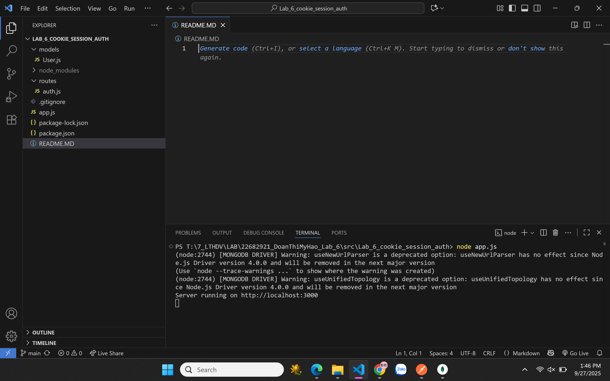
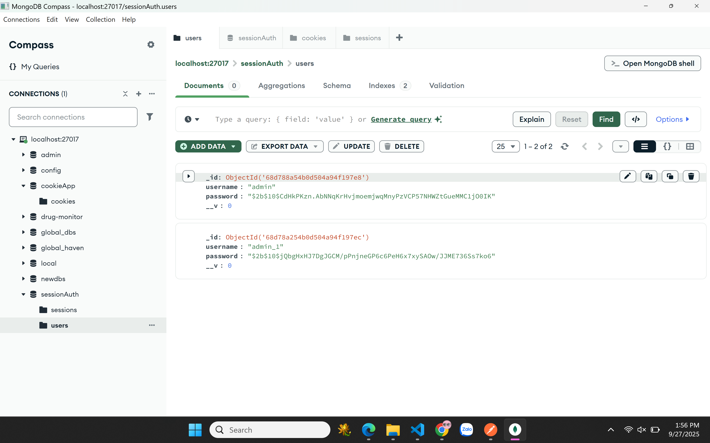
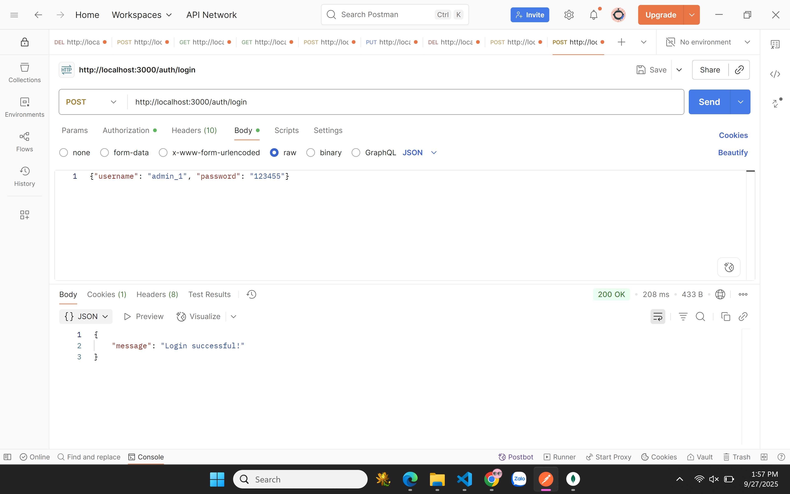
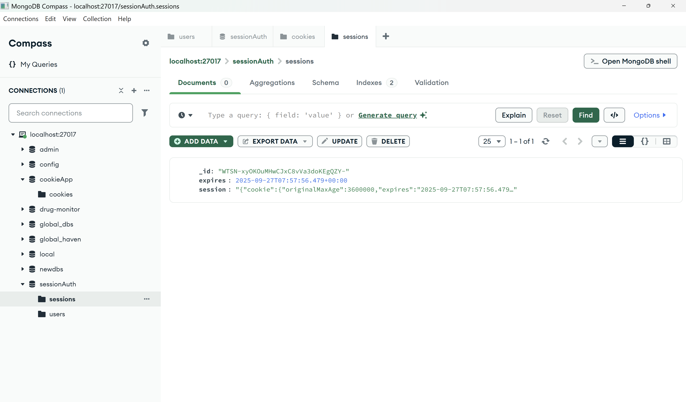
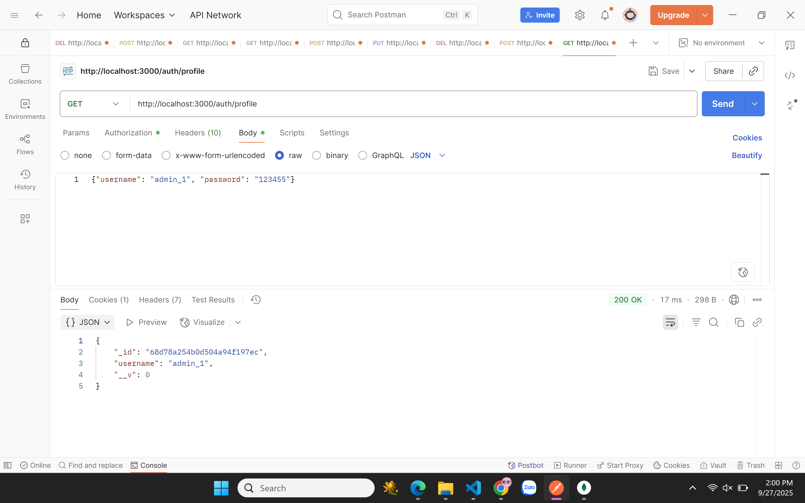
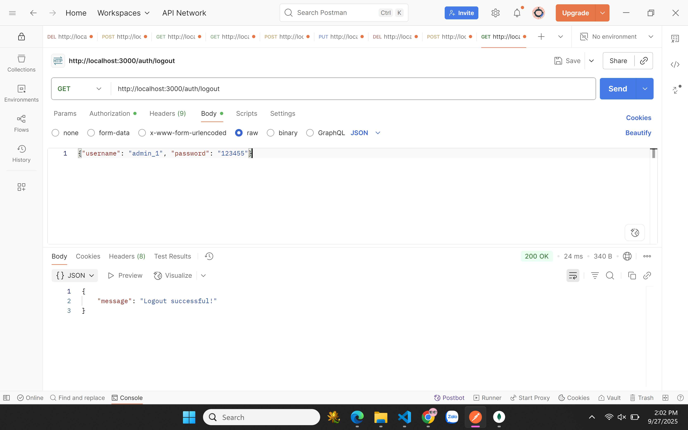
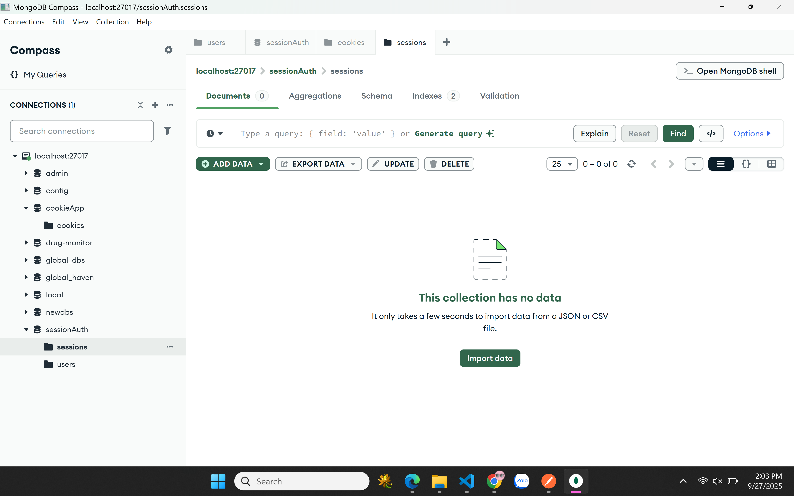

2. cookie_session_auth source code 
a. node app.js 

b. register 

Check in database

c. login 

Check in database

d. go to profile 

e. go to logout and check cookie is deleted in database 

Check in database
